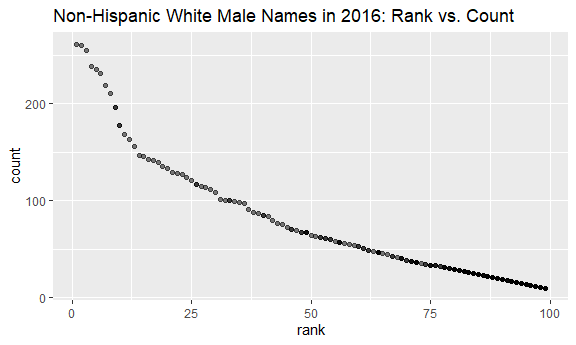

Homework 2
================
Safiya Sirota
2021-10-09

-   [Problem 1](#problem-1)
-   [Problem 2](#problem-2)
-   [Problem 3](#problem-3)

## Problem 1

**Importing Mr. Trash Wheel dataset:**

``` r
mrtrash_df <- 
  read_excel(
    "./data/Trash-Wheel-Collection-Totals-7-2020-2.xlsx",
    sheet = "Mr. Trash Wheel",
    range = "A2:N406"
    ) %>% 
  janitor::clean_names() %>% 
  drop_na(dumpster) %>% 
  mutate(sports_balls = round(sports_balls,0))
```

**Importing precipitation datasets:**

2018 dataset:

``` r
prcp_2018 <-
  read_excel(
    "./data/Trash-Wheel-Collection-Totals-7-2020-2.xlsx",
    sheet = "2018 Precipitation",
    skip = 1
  ) %>% 
  janitor::clean_names() %>% 
  drop_na(month, total) %>% 
  mutate(year = 2018)
```

2019 dataset:

``` r
prcp_2019 <-
  read_excel(
    "./data/Trash-Wheel-Collection-Totals-7-2020-2.xlsx",
    sheet = "2019 Precipitation",
    skip = 1
  ) %>% 
  janitor::clean_names() %>% 
  drop_na(month, total) %>% 
  mutate(year = 2019)
```

Combining and tidying the two prcp datasets:

``` r
prcp_tidy <-
  bind_rows(prcp_2018, prcp_2019) %>% 
  mutate(month = month.name[month]) %>% 
  select(year, month, prcp_amt = total)
```

**Describing the datasets:**

There are 24 observations in the `prcp_tidy` dataset and 344
observations in the `mrtrash_df` dataset. The key variables in the
`mrtrash_df` dataset are:

-   **dumpster identification** (dumpster, month, year, date),

-   **amount of trash** (weight\_tons, volume\_cubic\_yards),

-   **types of trash** (plastic\_bottles, polystyrene, cigarette\_butts,
    glass\_bottles, grocery\_bags, chip\_bags, sports\_balls), and

-   **number of homes powered** (homes\_powered)

The key variables in the `prcp_tidy` dataset are:

-   **year, month** and

-   **precipitation amount**.

For available data, the total precipitation in 2018 was 70.33 inches.
The median number of sports balls in a dumpster in 2019 was 8.

## Problem 2

**Importing and cleaning `pols-month` dataset:**

``` r
pols_df <- read_csv("./data/fivethirtyeight_datasets/pols-month.csv") %>% 
  separate(mon, into = c("year", "month", "day"), sep = "-") %>% 
  mutate(
    year = as.numeric(year), 
    month = month.name[as.numeric(month)],
    day = as.numeric(day),
    president = case_when(
      prez_gop == 1 ~ "gop",
      prez_dem == 1 ~ "dem")
    ) %>% 
  select(-prez_gop, -prez_dem, -day)
```

    ## Rows: 822 Columns: 9

    ## -- Column specification --------------------------------------------------------
    ## Delimiter: ","
    ## dbl  (8): prez_gop, gov_gop, sen_gop, rep_gop, prez_dem, gov_dem, sen_dem, r...
    ## date (1): mon

    ## 
    ## i Use `spec()` to retrieve the full column specification for this data.
    ## i Specify the column types or set `show_col_types = FALSE` to quiet this message.

**Importing and cleaning `snp` dataset:**

``` r
snp_df <- read_csv("./data/fivethirtyeight_datasets/snp.csv") %>% 
  separate(date, into = c("month", "day", "year"), sep = "/") %>% 
  mutate(
    year = case_when(
      year < 22 ~ 2000 + as.numeric(year), 
      year > 22 ~ 1900 + as.numeric(year)
    ),
    month = month.name[as.numeric(month)],
    day = as.numeric(day)
  ) %>% 
  select(year, month, close)
```

    ## Rows: 787 Columns: 2

    ## -- Column specification --------------------------------------------------------
    ## Delimiter: ","
    ## chr (1): date
    ## dbl (1): close

    ## 
    ## i Use `spec()` to retrieve the full column specification for this data.
    ## i Specify the column types or set `show_col_types = FALSE` to quiet this message.

**Importing and cleaning `unemployment` dataset:**

``` r
unemploy_df <- read_csv("./data/fivethirtyeight_datasets/unemployment.csv") %>% 
  pivot_longer(
    Jan:Dec,
    names_to = "month",
    values_to = "unemp_pct"
  ) %>% 
  mutate(month = month.name[match(month, month.abb)]) %>% 
  rename(year = Year)
```

    ## Rows: 68 Columns: 13

    ## -- Column specification --------------------------------------------------------
    ## Delimiter: ","
    ## dbl (13): Year, Jan, Feb, Mar, Apr, May, Jun, Jul, Aug, Sep, Oct, Nov, Dec

    ## 
    ## i Use `spec()` to retrieve the full column specification for this data.
    ## i Specify the column types or set `show_col_types = FALSE` to quiet this message.

**Joining all three datesets:**\_

``` r
five38_df <-
  full_join(pols_df, snp_df, by = c("year", "month")) %>% 
  full_join(unemploy_df,by = c("year", "month"))
```

**Desribing the datasets:**

## Problem 3

**Importing and tidying `popular_baby_names` dataset:**

``` r
names_df <- read_csv("./data/Popular_Baby_Names.csv") %>% 
  janitor::clean_names() %>% 
  mutate(
    gender = str_to_title(gender),
    ethnicity = str_to_title(ethnicity),
    childs_first_name = str_to_title(childs_first_name),
    ethnicity = recode(ethnicity, 
                       "Asian And Paci" = "Asian And Pacific Islander",
                       "Black Non Hisp" = "Black Non Hispanic",
                       "White Non Hisp" = "White Non Hispanic")
  ) %>% 
  distinct(year_of_birth, rank, ethnicity, childs_first_name, .keep_all = TRUE)
```

    ## Rows: 19418 Columns: 6

    ## -- Column specification --------------------------------------------------------
    ## Delimiter: ","
    ## chr (3): Gender, Ethnicity, Child's First Name
    ## dbl (3): Year of Birth, Count, Rank

    ## 
    ## i Use `spec()` to retrieve the full column specification for this data.
    ## i Specify the column types or set `show_col_types = FALSE` to quiet this message.

The case structure of `childs_first_name` was inconsistent throughout
the data, but we were able to fix this with the `str_to_title` function.

We could also see that the values of `ethnicity` were not consistent
throughout the dataset, with API, non-hispanic black, and non-hispanic
white indicators changing throughout. We were able to fix this by
recoding the ethnicity variable values.

Lastly, we needed to get rid of duplicates. The `distinct()` function is
useful for this.

**Creating a readable `olivia` table**:

``` r
olivia <- 
  filter(names_df, 
         childs_first_name == "Olivia" 
         & gender == "Female") %>% 
  select(ethnicity, rank, year_of_birth) %>% 
  pivot_wider(
    names_from = "year_of_birth",
    values_from = "rank"
  )
```

**Creating a readable table for the most popular male name**:

First, we should determine the most popular male name over time. I will
define this as the male name with highest count across all years in the
dataset. We can make a table to help:

``` r
pop_name <-
  filter(names_df, gender == "Male") %>% 
  select(childs_first_name, count) %>% 
  group_by(childs_first_name) %>% 
  summarize_all(sum) %>% 
  arrange(desc(count))
```

We find that the most popular male name is Ethan, so now we will make an
`ethan` table.

``` r
ethan <- 
  filter(names_df, 
         childs_first_name == "Ethan" 
         & gender == "Male") %>% 
  select(ethnicity, rank, year_of_birth) %>% 
  pivot_wider(
    names_from = "year_of_birth",
    values_from = "rank"
  )
```

**Making a scatterplot of `rank` vs. `count`:**

``` r
names_df %>% 
  filter(gender == "Male" & ethnicity == "White Non Hispanic") %>% 
  ggplot(aes(x = rank, y = count)) +
  geom_point()
```


